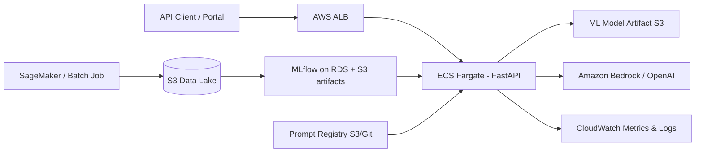

# Design Document — GenAI Claim Approval Agent

## 1. Architecture overview

**Components**

| Layer | Local prototype | AWS target |
|-------|-----------------|------------|
| API | FastAPI + Uvicorn | ECS Fargate behind ALB |
| ML inference | joblib on disk | Model in S3; optional SageMaker endpoint |
| LLM | OpenAI-compatible HTTP | Amazon Bedrock (Claude/Titan) or private OpenAI |
| Experiment tracking | MLflow local | MLflow on ECS + S3 artifact store |
| Config / prompts | `prompts/` in Git | S3 versioned bucket + Parameter Store |

## 2. ML modelling

**Objective:** Binary classification — P(claim approved).

**Pipeline:** Imputation → encoding/scaling → Gradient Boosting.

**Hyperparameter tuning:** `GridSearchCV` over `n_estimators`, `max_depth`, `learning_rate` with F1 score (handles ~16% decline class imbalance better than accuracy alone).

**Metrics (production):**

- Primary: F1 (declined class), ROC-AUC
- Secondary: precision/recall per class, calibration (Brier score on holdout)
- Business: decline rate vs historical baseline, override rate after human review

**Drift monitoring:** Compare weekly feature distributions (PSI) and approval-rate shift; retrain trigger when PSI > 0.2 or F1 drops > 5% on labeled shadow set.

## 3. GenAI / LLMOps

### Multi-persona explanations

1. **Retrieve context:** structured claim + `issueDesc` + ML prediction + heuristic factors.
2. **Persona conditioning:** separate system/user templates with role-specific tone and actions (`prompts/explanation_*.txt`).
3. **Guardrails:** instruct model not to invent facts; low-temperature (0.3) for consistency.

### Prompt engineering rationale

| Technique | Purpose |
|-----------|---------|
| Structured JSON input | Reduces hallucination; mirrors API schema |
| Explicit factor list | Grounds narrative in model/heuristic signals |
| Persona guidance block | Steers vocabulary without separate fine-tunes |
| Versioned prompt files | Auditable changes; CI diff on prompt PRs |

### Synthetic claim generation

Prompt constrains output schema and focuses on:

- **denial_patterns:** coverage/claimType mismatch, inactive policy
- **borderline:** high excess, delayed reporting, partial docs

Generated rows feed offline evaluation (does ML change prediction?) before optional retraining.

### LLM quality metrics

- Human rubric score (clarity, faithfulness, actionability) on sample
- Automated: claim-field citation check, toxicity filter
- Latency P95 and token cost per request

## 4. AWS deployment (recommended)

| Service | Role | Justification |
|---------|------|---------------|
| **ECS Fargate** | Host FastAPI containers | Serverless ops, auto-scaling, no EC2 patching |
| **ALB** | HTTPS ingress | Health checks, path-based routing |
| **S3** | Data, models, prompts, logs archive | Durable, cheap artifact store |
| **RDS (PostgreSQL)** | MLflow backend | Central experiment + model registry metadata |
| **Secrets Manager** | API keys (OpenAI/Bedrock) | Rotation without image rebuild |
| **Amazon Bedrock** | Managed LLM inference | Data residency, IAM auth, no key in app code |
| **CloudWatch** | Logs, metrics, alarms | Latency, 5xx, decline-rate anomaly |
| **EventBridge + CodePipeline** | CI/CD | Build image, run tests, deploy on tag |

**Cost controls:** Fargate min tasks = 1; scale on CPU; cache explanations by claim hash (short TTL); use smaller Bedrock model for draft explanations.

## 5. MLOps / LLMOps practices

| Practice | Implementation |
|----------|----------------|
| IaC | Terraform/CDK for ECS, ALB, S3, IAM |
| CI/CD | GitHub Actions: lint, train smoke, pytest, build/push ECR image |
| Model registry | MLflow register `claim_approval_model` with stage `Staging` → `Production` |
| Prompt registry | Git tags + S3 sync; deployment ties image tag to prompt version |
| Canary | Route 5% traffic to new model; compare F1 on labeled feedback |
| Rollback | Revert ECS task definition + MLflow production alias |

Demonstrated locally: MLflow runs, `models/metrics.json`, prompt files in repo, `.github/workflows/ci.yml`.

## 6. Evaluation & responsible AI

### ML evaluation

- Holdout stratified split (80/20)
- Report confusion matrix, F1, ROC-AUC
- Slice analysis by `country`, `claimType`, `coverage`

### GenAI evaluation

- Faithfulness: factors mentioned must appear in input
- Persona adherence: manual or LLM-judge checklist
- Hallucination sampling: weekly audit of 50 explanations

### Fairness & transparency

- Monitor approval probability by `country` and `channel` for disparate impact
- Explanations must cite policy-relevant fields, not sensitive proxies
- Human-in-the-loop for probabilities 0.45–0.55
- Customers receive plain-language outcome + appeal path

### Security

- No PII in logs; mask `issueDesc` in CloudWatch
- TLS termination at ALB; IAM roles for S3/Bedrock (no static keys in containers)

## 7. Demo script (presentation)

1. `python -m claim_agent.train` — show MLflow metrics
2. `python scripts/demo.py` — prediction + 3 personas
3. `uvicorn claim_agent.api.main:app --app-dir src` — Swagger `/docs`
4. POST `/synthetic` — show denial-focused scenarios
5. GET `/metrics` — runtime stats

## 8. Alternatives considered

- **XGBoost/LightGBM:** Better accuracy potential; chose sklearn GBC for zero extra native deps in take-home
- **LLM-as-classifier:** Higher cost/latency; ML handles structured decision, LLM explains
- **RAG over policy docs:** Valuable extension; omitted for scope; factors heuristics approximate policy checks
